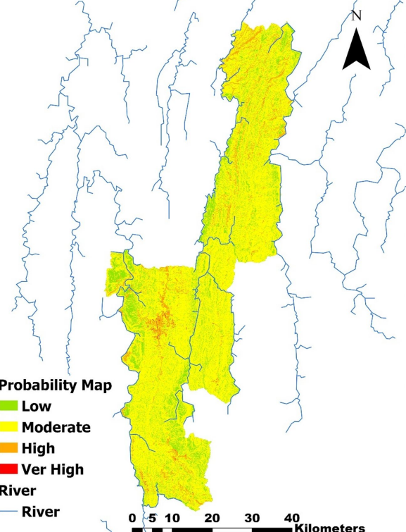

# Hybrid Machine Learning-RUSLE Approach for Soil Erosion Assessment
*A Study of Aizawl District, Mizoram, Northeast India*

## Overview

[cite_start]This project quantifies modeled average annual soil loss and delineates high-risk erosion zones using high-resolution remote sensing data[cite: 15]. [cite_start]By integrating the **Revised Universal Soil Loss Equation (RUSLE)** with **Machine Learning**, the study identifies a critical "erosion paradox"—where high forest cover masks localized degradation hotspots driven by extreme topography[cite: 16, 19].

[cite_start]**Study Area:** Aizawl District, Mizoram [cite: 5, 6]  
[cite_start]**Duration:** 2025 – 2026 [cite: 592]  
[cite_start]**Role:** Lead Researcher / Geospatial Analyst [cite: 573]  
[cite_start]**Status:** Published Research (March 2026) [cite: 592]

---

## Methods & Tools

**Data Sources**
- [cite_start]**Precipitation:** CHIRPS daily gridded rainfall data (2001–2024)[cite: 133, 188].
- [cite_start]**Soil:** USDA soil classification database (250m resolution)[cite: 166].
- [cite_start]**Topography:** SRTM Digital Elevation Model (30m resolution)[cite: 173].
- [cite_start]**Land Cover:** Sentinel-2 & Dynamic World near real-time (NRT) data[cite: 188, 194].

**Processing Steps**
1. [cite_start]**Cloud Computing:** Used **Google Earth Engine (GEE)** for parallelized pixel-based operations of Rainfall (R), Soil (K), and Cover (C) factors[cite: 17, 92].
2. [cite_start]**Terrain Modeling:** Utilized **ArcGIS 10.8** to compute Slope Length and Steepness (LS) factors in complex, high-relief terrain[cite: 17, 129].
3. [cite_start]**ML Integration:** Compared **Random Forest (RF)** and **Support Vector (SV)** algorithms to predict soil loss patterns[cite: 16, 154].
4. [cite_start]**Zonation:** Generated an erosion probability map using Weighted Index Overlay (WIO) based on Land Use, Slope, and Rainfall[cite: 200, 201].

**Tools Used**
- [cite_start]**Google Earth Engine:** Big data satellite processing[cite: 17].
- [cite_start]**ArcGIS 10.8:** Hydrological continuity and flow accumulation modeling[cite: 174, 175].
- [cite_start]**Machine Learning:** Random Forest (RF) for high-accuracy predictive modeling[cite: 18, 56].

---

## Key Findings

- [cite_start]**Predictive Excellence:** The **Random Forest** model achieved high alignment with the RUSLE baseline ($R^2 = 0.93$), significantly outperforming Support Vector Machines ($R^2 = 0.44$)[cite: 18, 384].
- [cite_start]**The Paradox:** Despite high forest cover, the estimated mean annual soil loss was **151.15 t/ha/yr**, largely due to steep topography overrides[cite: 18, 19].
- [cite_start]**Risk Zones:** 52% of the district falls under a slight erosion risk zone, while 45% falls under a moderate zone[cite: 19].
- [cite_start]**Correlations:** Soil loss was most significantly triggered by the **LS factor** ($r=0.34$), **P factor** ($r=0.34$), and **R factor** ($r=0.27$)[cite: 18, 425].

---

## Links

[View Research PDF](../assets/Project.pdf){ .md-button }

[Source Code Repo](https://github.com/3AMax/3Amax.github.io){ .md-button }
