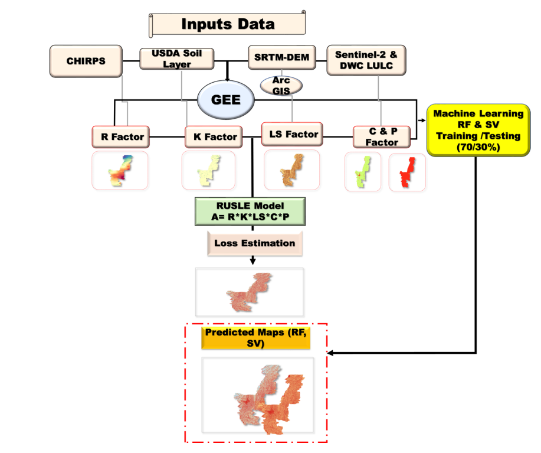

# Hybrid Machine Learning-RUSLE Approach for Soil Erosion Assessment
*A Study of Aizawl District, Mizoram, Northeast India*

## Overview

This project quantifies average annual soil loss and delineates high-risk erosion zones in the Eastern Himalayas. By integrating the **Revised Universal Soil Loss Equation (RUSLE)** with **Machine Learning**, the study identifies a critical "erosion paradox"—where high forest cover masks localized degradation hotspots driven by extreme topography.

**Study Area:** Aizawl District, Mizoram  
#**Duration:** 2025 – 2026  
**Role:** Lead Researcher / Geospatial Analyst  
**Status:** Published Research

---

## Methods & Tools

**Data Sources**
- **Precipitation:** CHIRPS daily gridded rainfall data (2001–2024).
- **Soil:** USDA soil classification database (250m resolution).
- **Topography:** SRTM Digital Elevation Model (30m resolution).
- **Land Cover:** Sentinel-2 & Dynamic World near real-time (NRT) data.

**Processing Steps**
1. **Cloud Computing:** Used **Google Earth Engine (GEE)** for parallelized pixel-based operations of Rainfall (R), Soil (K), and Cover (C) factors.
2. **Terrain Modeling:** Utilized **ArcGIS 10. hydro tools** to compute Slope Length and Steepness (LS) factors in complex, high-relief terrain.
3. **ML Integration:** Trained **Random Forest (RF)** and **Support Vector (SV)** algorithms to predict soil loss patterns.
4. **Zonation:** Generated an erosion probability map using Weighted Index Overlay (WIO).

**Tools Used**
- **Google Earth Engine:** Big data satellite processing.
- **ArcGIS 10.8:** Hydrological continuity and flow accumulation modeling.
- **Python/ML:** Random Forest regression for accuracy validation.

---

## Key Findings

- **Predictive Excellence:** The **Random Forest** model achieved high alignment with the RUSLE baseline ($R^2 = 0.93$), significantly outperforming Support Vector Machines.
- **The Paradox:** Despite high forest cover, the estimated mean annual soil loss was **151.15 t/ha/yr**, largely due to steep slopes overrides.
- **Risk Zones:** 45% of the district falls under a "Moderate" erosion risk, with high-to-very-high prone areas concentrated along riverbanks and barren lands.
- **Correlations:** Soil loss was most significantly triggered by the **LS factor** (topography) and **R factor** (monsoon rainfall intensity).

---

## Links

[View Research PDF](../assets/Project.pdf){ .md-button }
#[Source Code Repo](https://github.com/3AMax/3Amax.github.io){ .md-button }
